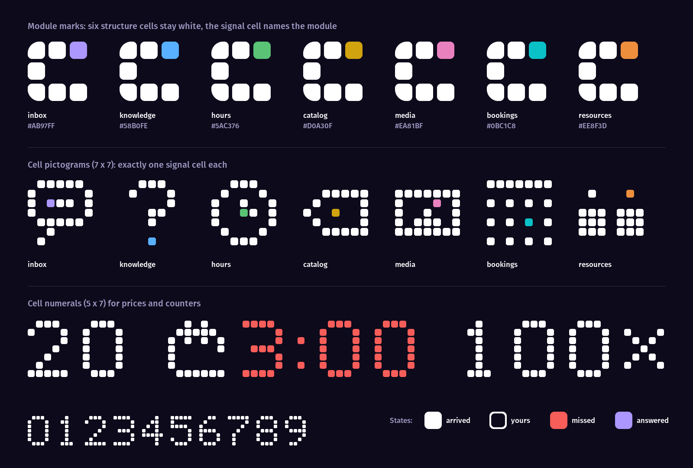
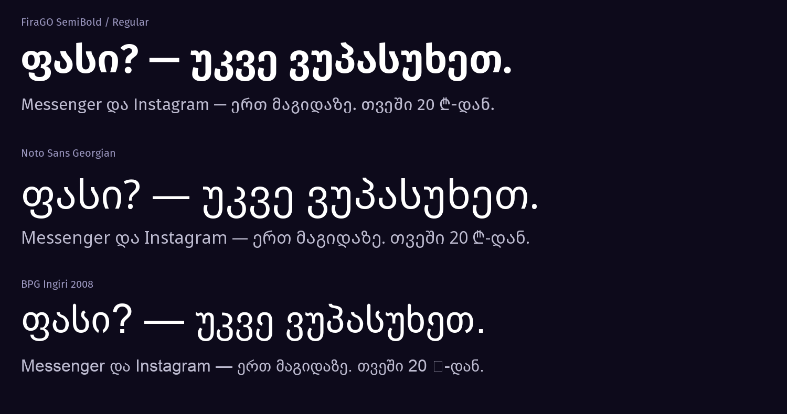

# Chaster landing page: design guidelines

This file is the single source of truth for the Chaster marketing site (Georgian first, English second). Three agents work from it, in order:

| Role | Agent | Owns | Status |
|---|---|---|---|
| Product architect | Opus 5.5 | Part 1: concept, design system, layout logic, wireframe hierarchy, component relationships, copy slots | **Done, v1.2 (30 Sep 2026)** |
| Frontend lead | Sonnet 5.5 | Part 2: turns Part 1 into Next.js + Tailwind code | **v1 built, in review (30 Sep 2026)**, see §2.9 and §2.10 |
| Brand voice and copywriter | Fable 5.1 | Writes the Georgian and English copy into the slots defined in §1.15 | Not started. Runs after the build |

How to use it:

- Part 1 is binding. If Sonnet or Fable needs to break a rule, they log it under "Deviations" in Part 2 with a reason, and the architect reviews it. They never change Part 1 silently.
- "Owner" means the Chaster founder. Anything marked **OWNER** is an open business decision, listed in §1.18.
- The brand kit lives in `C:\Users\Lenovo\Desktop\Chaster Facebook\final\`. It is read-only for this project. We copy files from it and never redraw them.
- The operator app's `DESIGN.md` (in the Chaster Facebook project) governs the product UI. This file governs the marketing site. Where the two overlap (tokens, status marks, icon rules), this file stays compatible with it.

Visual references produced for this spec:

- `design/cell-system-preview.png`: module marks, cell pictograms, cell numerals and cell states.
- `design/type-comparison.png`: FiraGO, Noto Sans Georgian and BPG Ingiri compared on navy.
- `design/tools/render_cell_preview.py`: the script that renders the preview. Its bitmaps are the drafts in §1.5.

Changelog: **v1.0** initial architecture · **v1.1** concept rewritten around blocks, calendar reading removed (owner) · **v1.2** conversion audit fixes: S2 rebuilt as two real threads, founder band added to S6, plan price set in type instead of cell numerals, live demo promoted to a first-class conversion goal, mid-page CTA added to S4, trust FAQ topics added, measurement made a build gate.

---

# PART 1: Product architecture (Opus 5.5)

## 1.1 Brief: facts this design rests on

**What Chaster is.** An operator desk and AI assistant for businesses that sell through Facebook Messenger and Instagram DMs. It answers customers in the business's name, using only the business's own data, and lets the owner take over any chat with one click.

**Modules in the product today.** The code registry in `src/ai/modules` has exactly seven:

| Module id | Customer-facing meaning | Type |
|---|---|---|
| `inbox` | Messenger and Instagram in one list. AI replies, handover (AI answering / you answering / closed), conversation memory | Core, always on |
| `knowledge` | FAQ and general info the AI answers from. When a chat ends, Chaster suggests new FAQ entries for approval | Core (see §1.14) |
| `hours` | Address, contact details, opening hours | Core (see §1.14) |
| `catalog` | Products and services with prices, variants, stock and "price on request" | Add-on |
| `media` | Sends catalog photos in the chat when a customer asks | Add-on, **requires `catalog`** |
| `bookings` | Hourly slots, full-day bookings and multi-day stays. Create, update and cancel inside the chat | Add-on |
| `resources` | Team, rooms and equipment with their own hours. Blocks double-booking of staff | Add-on, **requires `bookings`** |

The dependencies above are verified in code. `resources` only activates once booking settings exist, and `media` sends pictures of catalog items.

**Product truths the page may claim.** Each one is verified in the code:

- Replies in the language of the customer's latest message.
- Uses only facts from the business's FAQ, catalog, hours and bookings. It never invents prices, policies, hours or availability. When unsure, it tells the customer it will check with the team.
- Quotes prices exactly as written in the catalog and never converts currency.
- When a customer asks for a real person, or is angry, it tells them a team member will reply and flags the chat.
- When the owner takes over a chat, the AI stays silent until the owner hands it back.
- Sends photos only when asked.
- Staff cannot be double-booked (enforced by a database constraint).
- Every AI reply is logged for review.
- Connects through Meta's official APIs: Facebook Login for connecting the page and Graph webhooks for messages. No password sharing, no unofficial automation (verified: `api/auth/facebook`, `api/webhooks/meta`).
- The interface is available in Georgian and English.

**Claims the page must NOT make** (no supporting code exists): replying to post comments, WhatsApp, Telegram, taking payments in the chat, delivery tracking, analytics dashboards, and any statistic about results.

**Commercial frame (from the owner).**

- Primary CTA: connect your Facebook page and start a free trial in the app. The existing brand line is „დააკავშირე გვერდი“, with „უფასოდ სცადე“ underneath.
- Pricing: free trial, then from 20 ₾ a month. Add-ons are priced as placeholders until the owner decides (§1.14).
- Audience: every small business that sells through DMs. Named segments are shops, beauty (salons, barbers, nail studios), stays (guesthouses, apartments, hotels), food (restaurants, cafes) and clinics/services.
- Languages: Georgian at `/`, English at `/en`.
- Stack: a separate Next.js project in this folder, deployed on Vercel.

**Existing brand lines** (from the ads and Facebook covers). Fable may keep or refine them:

- „Messenger და Instagram — ერთ მაგიდაზე“
- „100x დღეში: „ფასი?““
- „ბუსტი ✅ გაყიდვა ❌“ (emoji stays in ads only, never on the site)
- „3 საათი უპასუხოდ = წასული კლიენტი.“
- „შენი დრო — თავისუფალია.“
- „დააკავშირე გვერდი“ / „უფასოდ სცადე“

## 1.2 What the research says

### AI-generated design has a measurable fingerprint

Several 2026 audits scored thousands of landing pages. They agree on a cluster of "unchosen defaults":

- Violet-to-indigo colour. The lavender-purple filled CTA has a nickname, "VibeCode Purple" (HSL 240–295°, 35%+ saturation).
- Inter or Geist everywhere.
- A centered hero with a pill badge above the H1.
- Gradient text, gradient blobs and orbs, colored glows, glassmorphism.
- Three identical icon-topped cards.
- Numbered 1-2-3 steps.
- Stat banners with count-up numbers.
- A logo wall.
- Three-tier pricing with the middle plan highlighted.
- A testimonial carousel.
- A chevron accordion FAQ.
- A four-column footer.
- The same fade-up animation on everything.
- Lucide icons and shadcn cards.
- "Get started" CTAs.
- An always-dark page with mid-grey text.
- Uppercase section kickers.
- The same `rounded-2xl` radius everywhere.
- The same padding on every section.

Any one of these can be a human choice. Four or more together read as generated.

**The risk specific to Chaster.** The brand's own palette (navy plus lavender `#AB97FF` / `#6447E1`) sits in the "VibeCode Purple on dark" zone, and the brand wordmark is set in Geist. The brand is not the problem. The problem is using lavender the way generators do: as button fills, gradients and glows. The brand sheet already contains the fix: *"The accent only ever colours the booked cell."* This site turns that sentence into its central law (§1.4, law 2).

### Georgian typography on the web

- Georgian (Mkhedruli) has no upper/lower case. Mtavruli capitals exist only for ALL-CAPS typography, and CSS `text-transform: uppercase` behaves differently per browser: Blink (Chrome, Edge) doesn't convert, while WebKit and Gecko do. **Never uppercase Georgian with CSS.**
- Letter-spacing adds trailing space in every browser, and tracked Georgian looks foreign. **Georgian is set at 0 tracking.**
- Georgian has no native italic tradition, so synthesised slants look wrong. **Emphasis comes from weight, not italics.**
- Mkhedruli has tall ascenders and descenders (ფ, ბ, ლ, ყ, ჟ), so it needs more leading than Latin at the same size.
- Georgian words are long, and browsers have no Georgian hyphenation dictionary. **Layouts must be tested with real Georgian at maximum slot length**, not English.
- Quotation marks are „ … “.

### The market

- Georgia, 2026: about 4.1M Facebook users, about 2.3M Instagram users and 3.4M Messenger users (NapoleonCat, Aug 2026). DataReportal puts Facebook ad reach at about 80% of the population.
- Most visitors will arrive **from Facebook/Instagram ads, inside the in-app browser, on a mid-range Android phone**. The first screen must continue the ad they just watched: same navy, same cells, same „ფასი?“ hook.
- Local selling culture: customers comment or DM „ფასი?“ and sellers answer „პირადში“ ("price in DM"). Many customers type Georgian in Latin letters ("fasi?", "ra girs?"). **OWNER:** confirm how well the AI handles Latin-typed Georgian before the page shows it.

### Meta platform requirements

A Facebook Login app needs a public, crawlable, non-geoblocked **privacy policy** that explains what data is processed, why, and **exactly how to request deletion** (a contact route, not just a statement). It also needs **terms**. The site therefore includes `/privacy`, `/terms` and `/data-deletion` as real pages from day one.

**Sources:**

- [What is AI slop](https://uxskill.laithjunaidy.com/what-is-ai-slop.html)
- [Sailop: 21 signs](https://sailop.com/blog/detect-ai-generated-site-30-seconds-21-signs-2026)
- [slop-detect rules](https://github.com/ravidsrk/slop-detect/blob/main/README.md)
- [Developers Digest: 16 patterns](https://www.developersdigest.tech/blog/ai-design-slop-and-how-to-spot-it)
- [signs-of-ai-design](https://github.com/febbhav/signs-of-ai-design)
- [W3C Georgian gap analysis](https://www.w3.org/TR/geor-gap/)
- [FiraGO](https://github.com/bBoxType/FiraGO)
- [DataReportal Georgia 2026](https://datareportal.com/reports/digital-2026-georgia)
- [NapoleonCat Georgia](https://stats.napoleoncat.com/social-media-users-in-georgia/)
- [Meta privacy policy expectations](https://developers.facebook.com/docs/development/terms-and-policies/privacy-policy/)
- [Meta Platform Terms](https://developers.facebook.com/terms)

## 1.3 The concept: built from blocks

The Chaster mark is seven rounded blocks, and one of them carries colour. It doesn't depict anything; it is a construction. The site uses that construction as its whole visual language and adds no decoration on top. In this document each block is called a **cell**.

- **Modular product, modular page.** Chaster is sold in modules, and everything visual on the page is built from the same block: the logo, numbers, icons, toggles and message states. The visitor literally assembles their own Chaster block by block (§1.12, S5).
- **A cell is always something:** a module, a message, a pixel of a number or icon, or part of the grid the page is drawn on. If a cell appears, you can say what it is.
- **One cell speaks.** In the mark, six cells are white and one is the **signal cell**, the coloured block. It is a free variable. By default it is brand lavender. When a module is the subject, it takes that module's colour. When a message has waited too long, it turns red. Colour appears nowhere else on the site.
- **The grid is the canvas.** The background is a faint grid of empty cells, the same pixel grid the ads and Facebook covers are drawn on. The layout grid has **7 columns**, echoing the seven blocks of the mark.
- **The ad becomes the page.** The 4-second outro (cells fly in, the C assembles, the colour block lights up, the wordmark appears) is the site's signature motion. It is used exactly twice: on arrival and at the end.

The result should feel like a precise, quiet instrument, the way a well-made watch feels. It should not feel like a startup template.

## 1.4 The laws

These are non-negotiable. Every review checks them.

1. **Every cell means something.** No decorative cells, bento boxes or pixel confetti. The only ambient cells are the background grid, kept faint and masked away under text.
2. **Lavender only lights cells.** Lavender (and every module colour) may fill a cell, a signal mark or a state square, and lavender may be used for the focus ring. Never for button fills, text, backgrounds, gradients, glows, borders or underlines. **Budget: colour covers 2% or less of any viewport.**
3. **Structure is sharp, cells are soft.** Frames, panels, bands and grids use 0–4 px radius. Cells, cell-buttons and bubbles use the brand's squircle geometry. The contrast between the two is part of the identity.
4. **Show the product working, don't describe it.** Every visual is real product behaviour: a thread, a booking, a price quote, a handover. No abstract illustrations, 3D objects, stock photos or AI imagery.
5. **Georgian first.** Every layout is designed and tested in Georgian at maximum slot length. English adapts to the Georgian layout, not the other way round.
6. **Tell the truth.** No invented numbers, testimonials, client logos, badges or "trusted by". Illustrative data is labelled as illustration. Claims come only from the product truths in §1.1.
7. **Rhythm, not repetition.** Sections vary in density, spacing and composition. No two neighbouring sections share a layout pattern.
8. **Built for the Facebook tap.** The page is designed for a phone in an in-app browser: fast, thumb-reachable, readable in sunlight. The desktop layout is an expansion of it.

## 1.5 The cell system



### Geometry (from `final/src/geom.py`, do not change)

- Unit cell: **28**. Gap: **6**. Pitch: **34**. The mark box is 96 × 96 (a 3 × 3 grid).
- Cell corner radius: **7**, drawn as a *continuous* corner (squircle-like, t = 0.28). Two outer sweep corners use **R19**: top-left of cell (0,0) and bottom-left of cell (0,2).
- Cells in the mark, as (column, row): (0,0) (1,0) (2,0) (0,1) (0,2) (1,2) (2,2). **The signal cell is (2,0), top-right.** Cells (1,1) and (2,1) are always empty.
- Below 32 px, use the small-size master geometry (cell 4, gap 1, radius 1, R 2.5 at 16 px; cell 8, gap 2, radius 2, R 5 at 32 px), as the kit rules require.
- Everywhere else, a "cell" uses radius = **25% of its side** (7/28), continuous where the renderer supports it.

### Signal vocabulary

This is how the "one coloured block" idea works. The six white cells are the Chaster platform, which is constant. The signal cell is the variable: its colour says *what this is about*.

| Signal | On dark | On paper | Meaning |
|---|---|---|---|
| Brand / Inbox | `#AB97FF` | `#6447E1` | Chaster itself, the core desk, "answered" |
| Knowledge | `#58B0FE` | `#016EB6` | FAQ, answers, "?" |
| Hours & place | `#5AC376` | `#05803A` | Open hours, address |
| Catalog | `#D0A30F` | `#846602` | Prices, products, an order |
| Photos (media) | `#EA81BF` | `#B90586` | A photo sent |
| Bookings | `#0BC1C8` | `#02797E` | A booking made |
| Team & rooms | `#EE8F3D` | `#9E5402` | A person or room assigned |
| State: missed | `#F75D59` | `#C92F33` | A message waiting too long. Used only in the "without Chaster" story |

How the palette was built: every module colour shares the OKLCH lightness and chroma of brand lavender on dark (L 0.736, C 0.148), or of deep lavender on paper (L 0.524). Only the hue rotates. That makes them one family, and no module looks louder than another. Contrast: every on-dark signal is at least 7.8:1 against ink, and every on-paper signal is at least 5.0:1 against white. Signals still never carry text (law 2).

Two more cell states have no colour:

- **Arrived.** A solid white cell: a message came in.
- **Yours.** A white outline ring, the "outline slot" from the brand's one-colour logo: a chat you're handling yourself.

### Brand amendment (v1.1 of the logo rules, requested by the owner on 30 Sep 2026)

The brand sheet calls the colour block "the booked cell" and says "Don't recolour the booked cell." That rule now reads:

- **The official logo never changes.** Lockups, favicon, app icon, nav, footer and social avatar keep lavender (or deep lavender on white) exactly as in the kit.
- **Module marks are a separate asset class.** A module mark is the symbol with its signal cell recoloured, **only** from the table above, and **only** where a specific module is the subject (the plan builder, module rows, module-specific ads, invoices).
- In every mark: the signal cell never moves, there is never more than one coloured cell, the empty cells are never filled, and there are no gradients, effects or rotation in the final state.

### Cell matrix: numerals and pictograms

The page's second typographic voice. Numbers and module icons are drawn with cells, never taken from a font or an icon library. Rendered as SVG components.

**Numerals** use a 5 × 7 grid (₾ is 7 wide, ":" is 1 wide). The glyph gap is 2 columns. `#` = cell, `.` = empty. These are drafts: refine optically, but keep the grid.

```
0      1      2      3      4      5      6      7      8      9      ₾        ×      ?      :
.###.  ..#..  .###.  ####.  ...#.  #####  ..##.  #####  .###.  .###.  ..#.#..  .....  .###.  .
#...#  .##..  #...#  ....#  ..##.  #....  .#...  ....#  #...#  #...#  .#####.  #...#  #...#  .
#...#  ..#..  ....#  ....#  .#.#.  ####.  #....  ...#.  #...#  #...#  #.#.#.#  .#.#.  ....#  #
#...#  ..#..  ...#.  .###.  #..#.  ....#  ####.  ..#..  .###.  .####  #.....#  ..#..  ..##.  .
#...#  ..#..  ..#..  ....#  #####  ....#  #...#  .#...  #...#  ....#  #......  .#.#.  ..#..  .
#...#  ..#..  .#...  ....#  ...#.  #...#  #...#  .#...  #...#  ...#.  #......  #...#  .....  #
.###.  .###.  #####  ####.  ...#.  .###.  .###.  .#...  .###.  .##..  .######  .....  ..#..  .
```

Where they're used: the 404 page and the setup timeline clock — small accents where a misread costs nothing. **Never for the plan price or any number the visitor acts on** (v1.2): those are set in FiraGO. The price is the most-read element on the page, and a decorative pixel font there adds friction at the exact point of decision. Everywhere else numbers are set in FiraGO with tabular figures. Always follow a price with a non-breaking space and then ₾, as in `20 ₾`.

**Pictograms** use a 7 × 7 grid. `*` marks the signal cell, and **every pictogram has exactly one**, the same 6 + 1 logic as the mark.

```
inbox      knowledge  hours      catalog    media      bookings   resources
.#####.    ..###..    ..###..    .......    .......    #######    .......
#.....#    .#...#.    .#...#.    ..#####    #######    .......    .#...*.
#.*##.#    .....#.    #..#..#    .#....#    #...*.#    #.#.#.#    .......
#.....#    ...##..    #..*#.#    #..*..#    #..#..#    .......    ###.###
.#####.    ...#...    #.....#    .#....#    #.###.#    #.#.*.#    ###.###
..#....    .......    .#...#.    ..#####    #######    .......    ###.###
.#.....    ...*...    ..###..    .......    .......    #.#.#.#    .......
```

The pictograms replace every icon library. UI glyphs (menu, close, arrow, external) are a separate, tiny stroke set; see §1.10.

### The cell field (background)

- A full-bleed grid of empty cells behind ink sections. Desktop pitch is **46 px** (cell 38, gap 8, radius 9.5). Every 4 field cells equal one layout column plus its gutter, so each column starts on a field cell. Mobile pitch is **(viewport width − 2 × margin) / 7**, so seven cells span the screen.
- Cells are fill `#181529` at 45% with a 1 px `#322E4B` stroke at 40%, the same values as the Facebook cover.
- A radial mask clears the field under all text. **Text never sits on visible field cells.** The field shows at the edges and in the gaps between compositions.
- **Lit field cells** (lavender fill at 12%, stroke at 30%) mark real events, for example the moment the hero conversation turns into an order or a booking. There are at most three per viewport, and each one lights up because something in the content caused it.
- The field is rendered in CSS/SVG and costs no JavaScript. Lit cells are absolutely positioned and snapped to the pitch.
- Paper sections have no field. Their structure comes from hairlines.

## 1.6 Colour tokens

Surfaces alternate on purpose. **Ink** carries the story; **paper** carries the decision (plan, rules, FAQ). This also avoids the "perma-dark with grey text" fingerprint.

| Token | Hex | Use | Contrast |
|---|---|---|---|
| `--ink` | `#0D0A1B` | Page background (dark sections), text on paper | n/a |
| `--surface` | `#181529` | Panels on ink (thread frame, desk, plan panel) | n/a |
| `--raised` | `#1D192F` | Elements inside panels (incoming bubble, rows) | n/a |
| `--line` | `#322E4B` | Hairlines on ink | Decorative |
| `--text` | `#EEEDF6` | Body text on ink | 16.8:1 |
| `--text-2` | `#BDBBD0` | Secondary text on ink | 10.4:1 |
| `--muted` | `#9D99C2` | Meta only (timestamps, captions, 13 px and up) | 7.2:1 |
| `--white` | `#FFFFFF` | Headlines on ink, cells, primary button fill on ink | 19.5:1 |
| `--paper` | `#F7F6FB` | Paper section background | n/a |
| `--paper-2` | `#EBEAF3` | Rows and blocks on paper | n/a |
| `--line-paper` | `#D9D7E5` | Hairlines on paper | Decorative |
| `--ink-2` | `#4D4962` | Secondary text on paper | 8.6:1 on white |
| `--sig-*` | §1.5 | Signal cells only | See §1.5 |
| `--focus` | `#AB97FF` on ink, `#6447E1` on paper | 2 px focus ring plus a 2 px offset in the surface colour | n/a |

There are no gradients, except the invisible radial *mask* on the field. There are no shadows: elevation comes from tone (ink, then surface, then raised).

## 1.7 Typography



**Decision: FiraGO for everything, plus cell numerals as small accents only (§1.5) — never for prices or numbers the visitor acts on.**

- One family covers Georgian (drawn by Akaki Razmadze, a Georgian type designer), Latin and ₾. Georgian lines constantly mix in Latin names (Messenger, Instagram, Chaster, AI), and a single family keeps those lines looking consistent. Pairing two families would break the rhythm inside every sentence.
- It isn't on any AI-default list (unlike Inter, Geist, Space Grotesk, Satoshi, Clash, Outfit, Poppins and DM Sans).
- Rejected: **BPG Ingiri** has no ₾ glyph and its Latin letters look like Arial. **Noto Sans Georgian** is solid but has no character and needs a Latin partner. **Geist** has no Georgian and is a v0/Vercel fingerprint. It stays only inside the outlined wordmark.
- **No monospace** anywhere. It's a decoration tell, and FiraGO's tabular figures do the job.

| Style | Desktop / mobile | Weight | Line height (ka / en) | Tracking (ka / en) |
|---|---|---|---|---|
| Display (H1) | 76 / 40 px | 600 | 1.12 / 1.04 | 0 / −0.02em |
| H2 | 48 / 30 px | 600 | 1.18 / 1.10 | 0 / −0.015em |
| H3 | 26 / 21 px | 600 | 1.30 / 1.25 | 0 / −0.01em |
| Lead | 21 / 18 px | 400 | 1.55 / 1.50 | 0 |
| Body | 17 / 16 px | 400 | 1.65 / 1.55 | 0 |
| UI (buttons, tabs, rows) | 16 / 16 px | 500 | 1.30 | 0 |
| Meta (time, captions) | 13 / 13 px | 500, tabular figures | 1.35 | 0 |

Rules:

- Weights 400, 500 and 600 only. Emphasis is 600, never italic.
- Body text runs 60 Georgian characters per line at most (`max-width: 34rem`).
- Headings use `text-wrap: balance`; body uses `text-wrap: pretty`.
- No uppercase, no letter-spacing on Georgian, no justified text, no hyphenation.
- Quotes are „ “. Times are 24-hour (`14:30`). Prices are `20 ₾` with a non-breaking space. Thousands use a thin space (`5 000`). Dates look like `30 სექტემბერი`.
- Headlines on ink are `--white`; body is `--text`. Grey body text is not allowed (it's the perma-dark tell).
- The wordmark is **never typed**, only placed as SVG from the kit.

## 1.8 Layout, spacing, radius, surfaces

**The seven-column grid.**

| Range | Columns | Column / gutter | Margins | Notes |
|---|---|---|---|---|
| 1280 px and up | 7 | 152 / 32 px (content 1256) | auto, 48 minimum | Field goes full-bleed |
| 1024–1279 px | 7 | Fluid / 24 px | 40 px | |
| 768–1023 px | 1-column flow | n/a | 32 px | Two-pane sections stack |
| Under 768 px | 1-column flow | n/a | 20 px | Field is 7 cells across |

Allowed desktop splits are 4+3, 3+4, 5+2, 2+5 and 7. **Never 6+6 or three equal thirds.** Asymmetry is the default.

**Spacing.** The base unit is 8, with the scale 4 · 8 · 12 · 16 · 24 · 32 · 48 · 64 · 96 · 144 · 208. Section rhythm has three deliberate steps (desktop / mobile):

- `--gap-tight`: 96 / 64
- `--gap-standard`: 144 / 88
- `--gap-grand`: 208 / 120

The step assigned to each section is in §1.11.

**Radius.**

- `--r-structure`: 0–4 px (bands, panels, frames, tables).
- `--r-cell`: 25% of the side (cells, cell-buttons, toggles).
- `--r-bubble`: 18 px, with the tail corner at 6 px.

Nothing gets a uniform `rounded-2xl`.

**Borders.** Separate by tone first and by 1 px hairlines second. No card grids, no nested cards, no coloured side strips.

## 1.9 Motion

There are one easing curve for movement, one for state changes, and four durations.

- `--ease-move: cubic-bezier(.2,.8,.2,1)` and `--ease-state: linear`. No bounce, no elastic.
- Durations: `120 ms` state change, `200 ms` UI, `360 ms` movement, `700 ms` full assembly.
- Transform and opacity only, via CSS or the Web Animations API. No animation library unless Part 2 justifies it.

| Name | What happens | Where | Rule |
|---|---|---|---|
| **Assemble** | 7 cells fly in (at most ±2 pitches away, at most 15° tilt *in flight only*) and snap into the mark in the outro order. The signal cell lands as an empty outline, then fills with colour, as in the outro | Hero, first visit per session. Final CTA, first time it enters the viewport | Never more often. The LCP text isn't blocked by it |
| **Light** | A cell goes from outline to solid | CTA hover and press, module toggles, the booking moment in threads | 120 ms |
| **Tick** | Cells change state in discrete steps, like a clock | Setup timeline | Driven by scroll position. **Never a count-up** |
| **Type** | Three cells pulse in sequence as the typing indicator, then the message appears | Hero thread, the with-thread in S2, FAQ answers | Plays once. Replays only when the business type changes |

**Text never animates in on scroll.** Headlines and paragraphs are simply there. Only cell-based components move.

`prefers-reduced-motion`: there is no flight, states switch instantly, and threads show all messages at once.

## 1.10 Imagery and icons

- **No stock photos, no AI images, no 3D, no illustrations.** The product UI, cells and pictograms carry the visuals.
- **Product photos** inside demo threads (for example the shop reply) must be real photos supplied by the owner. They're rendered as *pixel photos*: the image sampled at build time into squircle cells (about 24 × 24), which matches the pixel style of the ads. Until real photos exist, show a media-pictogram frame.
- **Channel marks**: the official Messenger and Instagram glyphs from Meta's brand resources, monochrome white on ink or ink on paper, with Meta's clear-space rules. They are functional labels, not a logo wall.
- **UI glyphs** (menu, close, arrow, external): a minimal custom set on a 24 px grid, 1.75 px stroke, square caps. Port them from the app's `src/components/icons.tsx` where they exist. **No Lucide, Heroicons, emoji or sparkle icons.**
- **Status**: text plus a tiny square cell, the app's `.ch-status` pattern ("AI პასუხობს ▪"). No pills and no green dots.
- **Founder photo** (v1.2): the one real photograph on the page (S6). Unstylised — no pixel treatment, no filters, structure radius. A real face is a trust signal; treating it as decoration would kill it.
- **Video** (v1.2): the real 45-second ad may be embedded once (S2) as click-to-play with a poster frame taken from the ad itself. Never autoplay, never looping background video.

## 1.11 Page architecture

### Sitemap

| Route | Page | Notes |
|---|---|---|
| `/` · `/en` | Landing | Georgian is the default. hreflang pairs, x-default = ka |
| `/privacy` · `/en/privacy` | Privacy policy | Meta requirement. Anchor `#data-deletion` |
| `/terms` · `/en/terms` | Terms | Meta requirement |
| `/data-deletion` · `/en/data-deletion` | Data deletion instructions | Goes in the Meta App Dashboard field |
| `404` | "A block is missing" | The mark with its signal cell as an empty outline |

Legal pages use the same type and tokens on paper, with a single column and no field.

### Conversion goals (v1.2)

Two goals, in order:

1. **Primary — connect your Facebook page** (opens the app with the plan parameters). High commitment: it asks for OAuth access, which frightens some owners.
2. **Secondary — the live demo:** message Chaster's own page on Messenger and let the product answer you. Zero commitment, zero risk, inside the app Georgians already live in. This is the warm-up step for everyone not ready to grant access, so it is a first-class goal, not a fallback.

Placement: the primary CTA appears in the nav, hero, mid-page ask (S4), plan panel (S5), final call (S8) and the mobile dock. The live demo appears in the hero (`hero.cta.alt`), at the end of the desk section (`desk.demo`), in the mid-page ask, in the founder band (S6) and in the final call. **Every viewport offers at least one of the two.**

### Section order and job of each section

This order deliberately breaks the stock sequence (hero, logos, three features, testimonials, pricing, FAQ). It follows the ad's story: pain, turn, product, start, choose, trust, ask, act.

| # | Id | Job (one idea per section) | Surface | Space after |
|---|---|---|---|---|
| S0 | `nav` | Identify, reach the CTA | Ink | n/a |
| S1 | `hero` | "This is your inbox, answered." Promise plus a live thread for *your* business type | Ink + field | grand |
| S2 | `day` | One „ფასი?“ at 23:40, twice: unanswered vs answered — two real threads, no legend to learn | Ink | standard |
| S3 | `desk` | You stay in control: one desk, AI or you with one click | Ink | tight |
| S4 | `setup` | "Live in minutes, no developer": a timeline of real minutes, not 1-2-3 steps | Ink | standard |
| S5 | `build` | Choose your modules and see the price: modules and pricing are one section | **Paper** | standard |
| S6 | `rules` | The house rules the AI follows (verified product truths), plus the person behind Chaster | Paper | tight |
| S7 | `faq` | Questions asked as a chat thread, answered by "Chaster" | Paper | grand |
| S8 | `final` | The ad's end card: the mark assembles, CTA, or message us directly | Ink + field | tight |
| S9 | `footer` | Legal entity, contact, legal links, language | Ink | n/a |

### Global state

**`businessType`**: `shop | beauty | stay | food | clinic | other`. The default is `shop`, because „ფასი?“ is the ad's hook.

- Read from `?for=` in the URL, so ads can deep-link a segment (for example a salon ad links to `/?for=beauty`). Then sessionStorage, then the default.
- One value drives the hero thread (S1), the sample thread in the desk (S3) and the module preset in the builder (S5). S2 uses a universal fixture (v1.2): personalisation already happened in the hero.

**`plan`**: the selected module ids plus a `dirty` flag. It starts from the preset for `businessType`. Once the visitor edits modules by hand (`dirty = true`), changing the business type no longer overwrites their choice.

- It drives the plan panel (S5), the mobile dock price and **every CTA link on the page**. All CTAs carry the plan: `APP_URL/connect?modules=catalog,media&for=shop&lang=ka`. **OWNER:** the app must accept these parameters.

| `businessType` | Preset add-ons | What the hero thread shows |
|---|---|---|
| `shop` | catalog, media | „ფასი?“ gets the price as written in the catalog, a pixel photo and the delivery info from the FAQ |
| `beauty` | bookings, resources | A request for a time slot gets free times with a named specialist and a confirmed booking |
| `stay` | bookings, resources, catalog, media | Dates get availability, room photos and a multi-day booking |
| `food` | bookings, catalog | A table request gets a booking; a menu question gets a price |
| `clinic` | bookings, resources | A price question gets the price plus a slot with a named doctor |
| `other` | none (core only) | "Are you open today?" gets hours and the address |

## 1.12 Section specs and wireframes

The wireframes show hierarchy and placement only. `c1–c7` are grid columns. All text is shown as slot ids (§1.15).

### S0 `nav`

```
DESKTOP
[lockup-standard 28px]            how · modules & price · faq      ქარ / EN   [▪ cta]
MOBILE
[lockup-standard 24px]                                             [▪ cta-short] [≡]
```

- A solid ink bar with a bottom hairline. It hides on scroll down and returns on scroll up. **No blur, no glass.**
- Links jump to S3, S5 and S7. The language switch keeps the current anchor and the `?for=` parameter.
- The mobile menu is a full-screen ink sheet: links as large rows with hairline dividers, then the CTA at the bottom within thumb reach.

### S1 `hero`

```
DESKTOP                                           (field visible at edges, cleared under text)
c1 ───────────────────── c4 │ c5 ─────────────── c7
                            │ type-tabs: shop · beauty · stay · food · clinic · other
hero.h1 (2 lines max)       │ ┌ thread panel (surface, r 4) ─────────────┐
                            │ │ [channel] name · now       ▪ AI პასუხობს │
hero.lead (3 lines max)     │ │ ◻ customer bubble                       │
                            │ │               Chaster bubble ◼          │
[▪ hero.cta]                │ │               [pixel photo]             │
hero.cta.note               │ │ ◻ customer bubble                       │
hero.cta.alt →              │ │               result line ▪(signal)     │
                            │ └─────────────────────────────────────────┘
                                                   lit field cell ▪ (when result lands)

MOBILE
hero.h1 (3 lines max) → hero.lead → [▪ hero.cta full width] → note → type-tabs (scroll) → thread (3 messages)
```

- **Not centered, no badge above the H1.** The headline and CTA sit left; the proof sits right.
- The thread is a faithful rebuild of the app thread in HTML (no screenshot, no browser or phone frame). Incoming bubbles are `--raised`; outgoing bubbles are `--white` with ink text. Timestamps are meta style outside the bubbles.
- **Sequence:** the mark assembles in the nav, then the thread plays with the Type motion. When the result line lands, it shows a signal cell in the matching module colour, and one field cell behind the panel lights up. Cause, then effect.
- The type tabs are underline tabs; the active one gets a small signal cell before its label. Changing the tab replays the thread.
- **Primary CTA ("cell-button"):** white fill on ink (ink fill on paper), ink text, height 56 (52 on mobile), radius 14. A **cell sits inside the button, left of the label, as an empty outline.** On hover or press it fills with lavender (the Light motion). This is the only place lavender meets a button, and it is still just a cell.
- The secondary action is a text link with an underline: message Chaster's own page on Messenger.

### S2 `day` (rebuilt in v1.2)

```
DESKTOP
day.h2 (c1–c4)                                day.lead (c5–c7)
┌ without (surface, r 4) c1–c3 ──────────┐   ┌ with (surface, r 4) c4–c7 ──────────────┐
│ day.without · 23:40                    │   │ day.with · 23:40                        │
│ ◻ day.q                        23:40   │   │ ◻ day.q                         23:40   │
│    ნახვა · 23:41  (meta)               │   │            Chaster reply ◼      23:41   │
│                                        │   │            [pixel photo]                │
│    — visible gap: silence overnight —  │   │ ◻ follow-up                             │
│ ◼ day.without.reply           11:20    │   │            booking / order line         │
│ outcome line ▪ missed                  │   │ outcome line ▪ module signal            │
└────────────────────────────────────────┘   └─────────────────────────────────────────┘
                 [▷ poster frame]  day.video.caption   (click-to-play, optional)

MOBILE
day.h2 → lead → without-thread → with-thread → [▷ poster] → day.note
```

- **Two real threads, one message.** The same customer message (`day.q`, „ფასი?“) arrives at 23:40 — the real evening peak of Georgian Facebook shopping. Left: seen at 23:41, answered by the owner at 11:20 the next morning, and the outcome line carries the red missed cell (the customer already bought elsewhere). Right: Chaster answers at 23:41 with the catalog price and a photo, and the outcome line carries the module signal. **No legend, no learning curve: everyone reads Messenger threads all day.** This replaces the v1.0 abstract cell board, which demanded decoding before it delivered any emotion.
- The threads reuse the S1 components and stay product-faithful. The with-thread plays with the Type motion when it enters the viewport; the without-thread is static — the silence is the point. One lit field cell appears behind the with-panel when its outcome lands.
- The "without" panel gets the narrower split (3 columns), the "with" panel the wider (4): relief gets more room than pain.
- The fixture is universal for every business type; personalisation already happened in the hero.
- **Optional video.** Below the threads, the real 45-second ad as a click-to-play poster: a real frame from the ad, the play glyph from the UI set, `day.video.caption` beneath. Never autoplay (§2.4). It continues the ad scent for visitors who came from the boosted campaign.
- `day.note` labels the scenario as an illustration.

### S3 `desk`

```
DESKTOP
desk.h2 (c1–c4)            desk.lead (c5–c7)
┌ desk frame, full width (surface, r 4) ─────────────────────────────────────────┐
│ inbox list (c1–c2)     │ thread (c3–c5)                 │ context (c6–c7)       │
│ flat rows, hairlines   │ bubbles, status, handover bar  │ booking strip /       │
│ name · time            │ [take over] [resume AI]        │ catalog item          │
│ one-line preview       │                                │                       │
└────────────────────────────────────────────────────────────────────────────────┘
   ①──────────┘              ②─────────┘   ③────┘                    ④────┘  ⑤
callouts: title + one line, set outside the frame with 1 px leader lines ending in a tiny cell

MOBILE
h2 → lead → thread only (frame) → callouts as a list below, each with its reference cell
```

- This rebuilds the real app (flat rows, no circular avatars, "AI პასუხობს / თქვენ პასუხობთ / დახურული" status text). Product UI strings are copied **exactly from the app's `ka.ts` / `en.ts`**, which use the formal register. Marketing copy around the frame uses Fable's register.
- **The section's one job (v1.2): you stay in control.** The composition centres on the handover moment: Chaster answering, the owner pressing take-over (status flips to „თქვენ პასუხობთ“ and the AI goes silent), then handing back. Losing control of their page is the visitor's biggest fear about any automation; this section exists to kill that fear.
- Three callouts only (v1.2, down from five): Messenger and Instagram in one list; AI or you with one click, and the AI stays silent until you hand back; a booking made in chat lands in your schedule.
- Callout markers are small cells containing a digit. They reference points on the drawing; they are not step numbers.
- The section ends with the live-demo line (`desk.demo`): try it on our own page → Messenger.

### S4 `setup`

```
DESKTOP
setup.h2 (c1–c3)            │ timeline (c4–c7)
setup.lead                  │ 00:00  ▫  step title        one line
                            │ 00:01  ▫  …
                            │ 00:04  ▫  …
                            │ 00:08  ▫  …
                            │ 00:10  ■  first message answered   (signal: inbox)
                            │
                            │ cta.mid   [▪ cta.primary]   demo link →
MOBILE: same timeline, full width, mid-page ask at the end
```

- This is a timed list of real minutes, not "1-2-3" circles. The cells fill with the Tick motion as each row enters the viewport.
- The steps: connect with Facebook, pick your pages (and the linked Instagram), add FAQs and prices, set hours and booking rules, then the first real message gets answered.
- **Mid-page ask (v1.2).** The timeline resolves into the page's only CTA band between the hero and the plan panel: one line (`cta.mid`), the primary CellButton and the live-demo text link. It lands exactly on the "it's this easy" beat, and it covers the desktop mid-page, where the mobile dock doesn't exist.
- **OWNER:** the times are placeholders until the real onboarding is timed. Fable must not promise a number that hasn't been measured.

### S5 `build`: modules and price

```
DESKTOP (paper)
build.h2 (c1–c4)                                         build.lead (c5–c7)
c1 ──────────────────────────────── c4                   c5 ───────────── c7  (sticky)
type-tabs (same state as hero)                           ┌ plan panel (INK block, r 4) ┐
                                                         │ module mark (signal = focus)│
core.title · core.note                                   │ plan strip ▪▪▪▪▪            │
▣ [inbox pictogram]  name      one line       included   │                             │
▣ [knowledge]        name      one line       included   │   45 ₾ / თვეში (FiraGO 600) │
▣ [hours]            name      one line       included   │   plan.per                  │
───────────────────────────────────────────────────────  │   plan.trial                │
addons.title · addons.note                               │  [▪ plan.cta]               │
◻ [catalog]    name   one line   +X ₾   [cell toggle]    │   plan.reassure (meta)      │
   └ example (expands on focus or tap): Q bubble / A     └─────────────────────────────┘
◻ [media]      name   one line   needs catalog   +X ₾
◻ [bookings]   name   one line   +X ₾
◻ [resources]  name   one line   needs bookings  +X ₾

MOBILE
h2 → lead → type-tabs → module rows → the plan panel becomes the bottom dock:
[plan strip] [20 ₾ / month] [▪ cta]   (replaces the global dock inside this section)
```

- **This replaces both the "features grid" and the "three-tier pricing table".** Modules are rows (flat, hairline dividers), not cards.
- **The toggle is a cell.** An empty outline means off; a solid cell in the module's signal colour means on (Light motion). It's accessible as `role="switch"` with the module name as its label.
- **Plan panel:** an ink "ticket" on paper, the page's strongest contrast point.
  - **Module mark.** Its signal cell shows the colour of the module being hovered, focused or last toggled, and returns to lavender when idle. It is a *module mark*, not the logo.
  - **Plan strip.** One small cell per module in the plan, in module colours, in grid order.
  - **Price** in FiraGO SemiBold, 44 px desktop / 34 px mobile (v1.2). The price is the most-read element on the page and must be readable in one glance; **cell numerals are banned here** (§1.5). On change, the number updates instantly and the plan strip animates (Light) — the digits never redraw theatrically.
- **Zero-interaction rule (v1.2).** The preset for the active business type is applied on load: the total, the plan strip and the CTA are all meaningful before the visitor touches anything. Configuring is optional play, not required work — the section must convert untouched. The default state is the preset, never "everything on": a 20 ₾ visitor must not meet a 60 ₾ first impression.
- **Dependencies:** turning on `media` also turns on `catalog`; turning off `catalog` also turns off `media`. The same pairing applies to `resources` and `bookings`. Each change is announced in an `aria-live="polite"` line (slot `build.dep.*`).
- Prices come from one config file (§1.14). There is no monthly/annual toggle unless the owner adds annual billing, and no "most popular" badge.

### S6 `rules` + founder band

```
DESKTOP (paper)
rules.h2 (c1–c3)    │ c4 ───────────────────────────────────── c7
rules.lead          │ ▪ rule (H3)                                 hairline
                    │   proof line (ink-2, meta size)
                    │ ▪ rule …  (7 rows)
──────────────────────────────────────────────────────────────────
┌ founder band (paper-2, r 4), full width ────────────────────────┐
│ [real photo]   founder.name · founder.role                      │
│   c1           founder.body (first person, c2–c5)               │
│                founder.cta → m.me/…  ·  phone (c6–c7)           │
└─────────────────────────────────────────────────────────────────┘
MOBILE: rules stacked, then the founder band: photo top, text below, contact within thumb reach
```

- There are seven rules (v1.2), each with a small signal cell in the colour of the relevant module. They come only from the product truths in §1.1: only your data; exact prices; "I'll check with the team"; a real person on request; silence when you take over; no double-booking; **and the official-API rule** — Chaster connects through Meta's official APIs (Facebook Login and Graph webhooks), no password sharing, nothing that risks your page (lavender signal). The last one answers the #1 Georgian objection: page-ban fear.
- **Founder band (v1.2).** Trust in a small market comes from people, not brands. A real photo, a real name and role, two first-person sentences (`founder.body`), a personal Messenger link („მომწერე პირადად“, `founder.cta`) and a phone number. This is the human trust layer the honesty rules would otherwise leave empty. The photo is the one real photograph on the page (§1.10). **OWNER:** supplies the photo and name, and signs off on appearing (§1.18).
- This section stands in for testimonials until real customers exist. When real customer quotes arrive (with permission), they join this section; they don't replace the founder.

### S7 `faq`

```
DESKTOP (paper)
faq.h2 (c1–c2)       │ c3 ──────────────────────────────── c6
faq.lead             │ ◻ question bubble (button)                      ← incoming side
faq.alt → Messenger  │                   answer bubble ◼  (on open)    ← Chaster side
                     │ ◻ question bubble
                     │ … 8 max
MOBILE: stacked, full width
```

- The FAQ *is* the Knowledge module at work: questions are incoming bubbles, and answers are outgoing bubbles from "Chaster", revealed with the Type motion.
- Accessible disclosure pattern: a `button` with `aria-expanded` and the answer region linked through `aria-controls`. Several answers can be open at once. There are no chevrons.

### S8 `final`

```
INK + field. The only centered composition on the page, on purpose: it mirrors the ad's end card.
        [Assemble → lockup custom-r, mark 96px desktop / 64px mobile]
        final.h2
        [▪ final.cta]
        final.note
        ─────────────── hairline ───────────────
        final.alt.title
        [Messenger]  [Instagram]            [QR drawn in cells, desktop only]
```

- The QR code opens Chaster's own Messenger page on the visitor's phone. It is rendered with squircle modules and keeps the finder patterns intact. **It must be test-scanned** on iOS and Android cameras before shipping.
- "Message us and Chaster will answer" is the proof: the visitor tries the real product.

### S9 `footer`

- **A single band, not four columns.** It holds the lockup, the legal entity line (company name and ID code, **OWNER**), contact details (email, phone as `+995 5XX XX XX XX`, Messenger), privacy · terms · data deletion, the language switch, and © 2026.

### Mobile dock (global)

- It appears once the hero CTA scrolls out of view and hides inside S5 (where the plan dock takes over) and inside S8.
- It contains the CTA and the plan price when the plan has been customised. It sits within the thumb zone and respects the in-app browser's safe area.

## 1.13 Component inventory and relationships

```
app/[locale]/page
└─ BusinessTypeProvider  (url ?for= → session → default)
   └─ PlanProvider       (preset from businessType, dirty flag, CTA href builder)
      ├─ Nav ─────────── Lockup · LangSwitch · CellButton
      ├─ Hero ────────── CellField · TypeTabs · Thread(Bubble · Status · ChannelMark · PixelPhoto · TypingCells) · CellButton
      ├─ DaySplit ────── Thread ×2 · OutcomeLine · VideoPoster
      ├─ DeskAnatomy ─── DeskFrame(InboxRow · Thread · HandoverBar · BookingStrip) · Callout
      ├─ SetupTimeline ─ TimelineRow(Cell)
      ├─ PlanBuilder ─── TypeTabs · ModuleRow(Pictogram · CellToggle · ExampleExchange) · PlanPanel(Mark · PlanStrip · PriceText · CellButton)
      ├─ HouseRules ──── RuleRow(Cell) · FounderBand
      ├─ FaqThread ───── Bubble · Disclosure · TypingCells
      ├─ FinalCall ───── Mark(assemble) · Lockup · CellButton · ChannelButton · CellQR
      ├─ Footer
      └─ MobileDock ──── reads PlanProvider, visibility from section observers
```

| Primitive | Responsibility | Rules |
|---|---|---|
| `Cell` | The atom. Renders the kit's continuous-corner path at any size. States: `empty`, `outline`, `solid`, `signal(moduleId or state)` | All other cell visuals compose this. Colour only through `signal()` |
| `Mark` | The 7 cells in fixed positions. Props: `variant` (dark, light, mono), `signal`, `assemble` | With `signal = brand`, geometry and colour must be pixel-identical to the kit SVG |
| `Lockup` | Places the kit SVG (`standard` or `custom-r`) | Never re-typed or re-drawn. Nav and footer use `standard`; final uses `custom-r` |
| `CellMatrix` | Renders a bitmap of cells | Base for `CellNumerals` and `Pictogram` |
| `CellField` | Background cell grid plus lit cells | CSS/SVG only. Masked under text |
| `CellButton` | Primary CTA with an inner outline cell that books on hover or press | One visual style. Two surfaces (ink, paper) |
| `CellToggle` | Switch built from a cell | `role="switch"` |
| `TypeTabs` | The business-type selector | Bound to `businessType`. Underline style |
| `Thread` / `Bubble` / `Status` | Product UI rebuilds | Strings from the app dictionaries where they are UI |
| `CellQR` | QR code drawn with squircle modules | Scannability tested |

## 1.14 Plan builder data model

A single config file is the source for the builder, the JSON-LD offer and the FAQ price answers.

```ts
type ModuleId = "inbox" | "knowledge" | "hours" | "catalog" | "media" | "bookings" | "resources";

export const pricing = {
  currency: "GEL",
  base: { monthly: 20, includes: ["inbox", "knowledge", "hours"] }, // OWNER: confirm what "from 20 ₾" includes
  trialDays: 14,                                                     // PLACEHOLDER (OWNER)
  addons: {
    catalog:   { monthly: 10, requires: null },        // PLACEHOLDER
    media:     { monthly: 5,  requires: "catalog" },   // PLACEHOLDER
    bookings:  { monthly: 15, requires: null },        // PLACEHOLDER
    resources: { monthly: 10, requires: "bookings" },  // PLACEHOLDER
  },
  vatIncluded: true,                                   // PLACEHOLDER (OWNER)
} as const;
```

- Total = base + the sum of enabled add-ons, shown as `N ₾` plus the per-month slot.
- **All placeholders render on the page exactly like real prices**, so the layout is tested with them. They are flagged in the config only, never on screen.
- JSON-LD: `SoftwareApplication` with `offers.priceCurrency = "GEL"` and `lowPrice = base.monthly`.

## 1.15 Copy architecture (Fable's brief)

### Voice direction

- **Who's speaking:** a sharp, calm Tbilisi business peer who has run a Facebook shop. Not a startup, not a bank, not a robot.
- **Register:** informal **შენ** on the marketing site, matching the ad („დააკავშირე“, „სცადე“). Formal **თქვენ** on the legal pages and inside product-UI rebuilds (copied from the app). **OWNER** confirms (§1.18).
- **Concrete nouns:** prices, hours, rooms, masters, photos, „ფასი?“. Real everyday phrases, including the „ფასი პირადში“ culture and Latin-typed customer messages (only once the owner confirms the AI handles them).
- **Banned:** hype words (რევოლუციური, ინოვაციური, უნიკალური, ჭკვიანი გადაწყვეტა), "AI-powered" phrasing, invented percentages, English calques, exclamation marks, emoji, "Get started / Learn more" equivalents.
- **Naming:** Chaster is the subject ("Chaster answers"), and "AI" appears only where the product UI uses it. Messenger, Instagram, Facebook and Chaster stay in Latin script.
- **Formatting:** „quotes“ · `20 ₾` · `14:30` · `30 სექტემბერი` · no ALL CAPS · sentence case in English.

### Slot inventory

Max lengths are in **characters, Georgian first**. English should stay at or under the Georgian length. `×type` means one variant per business type (6).

| Slot id | Where | Purpose | Max ka |
|---|---|---|---|
| `meta.title` · `meta.description` | `<head>` / OG | Search and share text | 60 · 155 |
| `nav.how` · `nav.modules` · `nav.faq` | S0 | Anchors | 14 each |
| `cta.primary` · `cta.short` | Global | Primary action (brand line: „დააკავშირე გვერდი“) | 18 · 12 |
| `hero.h1` | S1 | The promise | 42 |
| `hero.lead` | S1 | What Chaster does, for whom | 140 |
| `hero.cta.note` | S1 | Trial plus price anchor | 60 |
| `hero.cta.alt` | S1 | Message us on Messenger | 32 |
| `type.label` · `type.{shop,beauty,stay,food,clinic,other}` | S1, S5 | Selector | 12 each |
| `hero.thread.{type}.*` | S1 | 3–5 messages: customer (≤ 60), Chaster (≤ 140), result line (≤ 40) | ×type |
| `day.h2` · `day.lead` | S2 | The cost of slow replies | 48 · 160 |
| `day.without` · `day.with` | S2 | Panel labels | 20 each |
| `day.q` | S2 | The customer message both threads share | 40 |
| `day.without.reply` · `day.without.outcome` | S2 | The morning reply and what it cost | 60 · 60 |
| `day.with.reply` · `day.with.outcome` | S2 | Chaster's answer and the result | 140 · 60 |
| `day.video.caption` | S2 | Under the click-to-play ad | 60 |
| `day.note` | S2 | "Illustration" disclaimer | 80 |
| `desk.h2` · `desk.lead` | S3 | One desk | 48 · 160 |
| `desk.callout.{1–3}.title` · `.body` | S3 | Control-focused callouts | 32 · 90 |
| `desk.demo` | S3 | Live-demo line: message our page | 40 |
| `desk.sample.*` | S3 | Realistic fictional names, previews (≤ 40) and one thread | n/a |
| `setup.h2` · `setup.lead` | S4 | Live in minutes | 48 · 140 |
| `cta.mid` | S4 | Mid-page one-liner before the button | 60 |
| `setup.step.{1–5}.title` · `.body` | S4 | Timeline rows | 28 · 90 |
| `build.h2` · `build.lead` | S5 | Choose your modules | 48 · 140 |
| `build.core.title` · `.note` · `build.addons.title` · `.note` | S5 | Group headers | 24 · 60 |
| `module.{id}.name` · `.line` | S5 | 7 modules | 18 · 80 |
| `module.{id}.example.q` · `.a` | S5 | What your customer sees | 50 · 110 |
| `build.dep.{media,resources}.on` · `.off` | S5 | Dependency announcements | 60 |
| `plan.title` · `plan.per` · `plan.trial` · `plan.reassure` · `plan.included` | S5 | Plan panel | 20 · 10 · 60 · 80 · 24 |
| `rules.h2` · `rules.lead` | S6 | House rules | 48 · 140 |
| `rules.{1–7}.rule` · `.proof` | S6 | From the product truths only | 60 · 110 |
| `founder.name` · `founder.role` | S6 | Real name and role | 40 each |
| `founder.body` | S6 | Two sentences, first person | 220 |
| `founder.cta` | S6 | „მომწერე პირადად“ → Messenger | 20 |
| `faq.h2` · `faq.lead` · `faq.alt` | S7 | Questions | 40 · 120 · 40 |
| `faq.{1–8}.q` · `.a` | S7 | See topics below | 70 · 320 |
| `final.h2` · `final.note` · `final.alt.title` · `final.alt.qr` | S8 | End card | 40 · 60 · 40 · 60 |
| `footer.legal` · `footer.contact.*` · `footer.links.*` | S9 | Legal line and links | 120 |
| `notfound.title` · `.body` · `.link` | 404 | "A block is missing" | 32 · 90 · 24 |
| `legal.privacy` · `legal.terms` · `legal.deletion` | Legal | Plain-language drafts, **lawyer review required** | n/a |

**FAQ topics** (Fable picks 8; the first one is mandatory): **is this allowed by Facebook — will my page get banned** (answer: official Meta API, §1.1) · **what happens when the trial ends** · **do I need a card to start** · does it work with my existing page · do customers know it's automated · what if it answers wrong · can I reply myself · which languages it understands · how to pay and cancel · is my data safe · do I need help to set it up.

**Until Fable delivers:** Sonnet builds with placeholder strings **at the maximum Georgian length**, taken from real Georgian text (the existing brand lines, repeated if needed). This keeps wrapping realistic. Lorem ipsum and English stand-ins are not allowed.

## 1.16 Anti-pattern register

Everything here is banned on the site, with what Chaster does instead.

| Banned pattern | Why it reads as AI | Chaster instead |
|---|---|---|
| Lavender or violet filled buttons, violet gradients | "VibeCode Purple," the top fingerprint | White or ink cell-button. Lavender only as a cell (law 2) |
| Gradient text, gradient blobs or orbs, colored glows | Generator defaults | Flat tone, lit cells |
| Glassmorphism, blur navs | Reflexive default | Solid ink bar |
| Inter / Geist / Space Grotesk / Satoshi / Clash / Outfit everywhere | Default type | FiraGO plus cell numerals |
| Monospace for atmosphere | Decoration tell | Tabular figures |
| Centered hero with a badge or pill above the H1 | The "hero formula" | Asymmetric 4+3 hero, no badge |
| Uppercase kickers ("FEATURES") above every H2 | Templated sections, and broken in Georgian | The H2 starts the section |
| Three equal icon cards · bento grids | The most diagnostic layout | Module rows, the desk anatomy, the S2 day split |
| Numbered 1-2-3 steps / "01 02 03" markers | Template scaffolding | Timeline with real minutes |
| Stat banners, count-up numbers, implausible metrics | Fabricated trust | Labelled illustration, numbers driven by state |
| Logo walls, "Trusted by," fake badges | Fabricated trust | Channel marks as labels only, the product itself as proof |
| Testimonial carousel, gradient letter avatars, fake faces | Fabricated trust | House rules now; real quotes only with permission later |
| Three-tier pricing with a highlighted middle | Template pricing | The module builder |
| Chevron accordion FAQ | Template FAQ | The FAQ as a chat thread |
| Four-column footer | Footer fingerprint | A single band |
| Fade-up on every block · bounce easing · scattered micro-interactions | Motion slop | Four named motions, cells only |
| The same radius and padding everywhere | Monotony | Mixed radius, three rhythm steps |
| Lucide / emoji / sparkle icons | Toolchain default | Cell pictograms plus a tiny custom UI set |
| shadcn/ui cards, `text-gray-500`, default Tailwind palette | Toolchain default | Named tokens only |
| Always-dark page with grey body text | Perma-dark tell | Paper sections, `--text` 16.8:1 |
| Default favicon, OG image or 404 | Unfinished-template tell | Kit favicon, custom OG image, "block is missing" 404 |
| "Get started," "Learn more," "Try it free" | Generic microcopy | Specific action: „დააკავშირე გვერდი“ |
| Stock, 3D or AI imagery | Image slop | Product UI, pixel photos of real products |

## 1.17 Review checklist (every PR, every copy pass)

- [ ] Every cell on screen can be named: grid, message, module, state or numeral.
- [ ] Colour covers 2% or less of the viewport, and appears only in cells and the focus ring.
- [ ] The official logo is untouched. Module marks use only approved signals, and the signal cell stays top-right.
- [ ] No banned pattern from §1.16. Run [slop-detect](https://github.com/ravidsrk/slop-detect) against the preview URL as a second opinion.
- [ ] Georgian: no uppercase, no tracking, no italics, „“ quotes, NBSP before ₾, tested at maximum slot length at 360 px width.
- [ ] Every claim maps to a product truth in §1.1. Illustrations are labelled.
- [ ] Contrast: body 7:1 or better, meta 4.5:1 or better, cells 3:1 or better against their surface. Focus is visible everywhere.
- [ ] Reduced motion respected. The Assemble motion runs at most twice per visit.
- [ ] The Facebook in-app browser on Android loads the hero text in under 2 s on 4G.
- [ ] Every CTA carries the plan and business-type parameters.
- [ ] The primary CTA is the most visually prominent element in every viewport — by size and isolation, never by adding colour (v1.2).
- [ ] Both conversion goals are reachable per §1.11: the connect CTA and the live-demo link each appear in the hero, mid-page and final (v1.2).
- [ ] The plan price is set in FiraGO, never in cell numerals (v1.2).
- [ ] Privacy, terms and data-deletion pages are live, crawlable and linked in the footer.

## 1.18 Open questions for the owner

1. **Domain and app URL.** Where does "connect your page" land, and can the app read `?modules=`, `?for=` and `?lang=`?
2. **Prices.** What "from 20 ₾" includes, the add-on prices, trial length, VAT, billing period, payment methods (local cards, invoices for companies) and cancellation policy.
3. **Limits.** Any caps on AI replies, pages or conversations per plan?
4. **Legal entity.** Company name, ID code and address for the footer and the privacy policy.
5. **Chaster's own Facebook page and Instagram handle** for "message us" and the QR code.
6. **Instagram DMs.** Are they live in production? The webhook supports them; confirm before the headline claims it.
7. **Latin-typed Georgian ("fasi?").** How well is it handled? If well, the hero should show it.
8. **Real onboarding time,** for the setup timeline.
9. **Real product and room photos** from pilot businesses, and permission to use them. Any real customer quotes?
10. **Voice register:** informal შენ (recommended) or formal თქვენ.
11. **Approval of the module colour set and the brand amendment** in §1.5.
12. **Russian.** A third language later? The routing leaves room for `/ru`.
13. **Tracking consent.** Measurement is a build requirement (§2.4). Supply the Meta Pixel ID, and confirm with a lawyer what Georgia's 2024 personal data law requires for consent before events fire.
14. **Founder band (v1.2).** Your name, role, a real photo and a personal Messenger link for S6 — and your sign-off on appearing on the page.

---

# PART 2: Frontend build (Sonnet 5.5)

> **Status: not started.** Sonnet owns this part. The brief below is the architect's handoff. Sonnet fills in the sections marked "Sonnet" and keeps the log current.

## 2.0 Contract

- Build exactly what Part 1 specifies. If something is impossible or clearly worse in code, log it under §2.10 "Deviations" with the reason before shipping it.
- Sonnet decides component APIs, file layout, state libraries (prefer none) and implementation details. Sonnet does **not** decide colours, fonts, section order, copy, or the cell and signal rules.

## 2.1 Stack (architect's constraints)

- Next.js (current stable, App Router), TypeScript, **Tailwind CSS v4** with tokens declared in CSS `@theme`, deployed on Vercel.
- **Not allowed:** shadcn/ui, Radix themes, Lucide or any icon library, Framer Motion by default, UI kits.
- Read the Next.js docs bundled in `node_modules/next/dist/docs/` for the installed version before writing code. The sibling app's `AGENTS.md` warns that its Next.js version has breaking changes.
- Static rendering for every route. JavaScript only where interaction needs it (thread playback, builder, video embed, dock).

## 2.2 Fonts pipeline (architect's constraints)

- FiraGO Regular, Medium and SemiBold (OFL, from [bBoxType/FiraGO](https://github.com/bBoxType/FiraGO)), **subset** to Georgian `U+10A0–10FF`, Basic Latin and Latin-1, general punctuation `U+2010–2027` (including „ “ — …), `U+00A0`, `U+2009` and `U+20BE` (₾). Output woff2. The full TTFs are about 800 KB each; the target is under 45 KB per weight.
- Load with `next/font/local`. Preload SemiBold only (the H1 is the LCP element). Use `font-display: swap` with a metric-matched fallback.
- Keep the OFL license file in the repo.

## 2.3 Assets to copy from the brand kit

- `final/lockup/horizontal/chaster-lockup-horizontal-standard-{dark,light}.svg`
- `final/lockup/horizontal/chaster-lockup-horizontal-custom-r-dark.svg`
- `final/symbol/chaster-symbol-*.svg` (large and small masters, as the source for `Mark` and `Cell` paths)
- `final/favicon/*` and `final/app-icon/chaster-app-icon-dark-apple-touch-180.png`
- Official Messenger and Instagram glyph SVGs from Meta's brand resources. The PNGs in the app's `public/channels/` are too heavy (about 235 KB each).
- The 45-second captioned ad, `full_45s_preview_captioned.mp4`, from the Chaster Facebook project root (about 15 MB): re-encode to H.264 at 3 MB or less, plus a poster frame, for the S2 click-to-play embed.

## 2.4 Budgets and quality gates

- LCP under 2.0 s and CLS under 0.05 on a mid-range Android over 4G, **tested in the Facebook in-app browser**.
- Landing JavaScript under 90 KB gzipped. No autoplay video. The S2 video loads only on tap: the poster is a static image, and the file never counts against the initial load.
- **Measurement (v1.2, required):** Meta Pixel (ID from the owner, §1.18) plus events: `cta_click` (with section id), `demo_click`, `module_toggle`, `type_tab_change`, `faq_open`, `video_play`. Nothing fires before consent if the lawyer requires a banner (§1.18). Without these events the page's conversion claims can't be tested.
- WCAG 2.2 AA. Full keyboard path through tabs, toggles, the FAQ and the menu. Visible focus.
- `lang="ka"` / `lang="en"` on `<html>` per route, with hreflang alternates.
- A custom OG image per locale (1200 × 630: navy, field, lockup, one line) and a custom 404.

## 2.5 Suggested build order

1. Tokens, fonts, `Cell`, `Mark`, `Lockup`, `CellMatrix`, and a preview route showing the whole cell system for sign-off.
2. Layout shell: the grid, `CellField`, `Nav`, `Footer`, `MobileDock`, i18n routing, and the legal page template.
3. S1 hero with the thread engine and `TypeTabs`, plus `BusinessTypeProvider`.
4. S5 builder with `PlanProvider` and CTA links.
5. S2 day split (threads and the video poster), S3 desk, S4 setup timeline with the mid-page ask.
6. S6 rules, S7 FAQ thread, S8 final with the QR code.
7. Budgets, accessibility pass and slop audit (§1.17), then hand over to Fable.

## 2.6 Implementation decisions (Sonnet)

**Run it.** `npm run dev` (port 3000). `npm run check` runs the copy check, the brand-geometry proof, `tsc` and `eslint`. Other scripts: `check:copy`, `verify:brand`, `brand:extract` (regenerates the lockup and channel-glyph modules from the kit files in `src/brand/`), `python design/tools/build_fonts.py` (rebuilds the fonts), `python scripts/bundle-size.py` (after `next build`). Environment variables are documented in `.env.example`; facts only the owner can give live in `src/config/owner.ts`.

**Stack as built.** Next.js 16.3.7 (App Router, Turbopack), React 19.2.8, Tailwind 4.3 with tokens in `@theme`, TypeScript **5** (the registry's latest is 7; not risked on a brand-new compiler), `qrcode-generator` (server-side only, ships no client JS). No shadcn, no icon library, no animation library.

**Routing and locale.** The root layout is `app/[lang]/layout.tsx` (per the bundled i18n guide). Georgian is served at `/` by `beforeFiles` rewrites to `/ka/...` and `/ka/...` redirects back to the unprefixed URL; English is `/en`. Every route is statically generated. Because the root layout sits inside `[lang]`, an unmatched URL has no layout to compose a 404 from, so the 404 uses `experimental.globalNotFound` (Next's documented answer for this case).

**Brand fidelity.** `src/brand/geometry.ts` is a line-for-line port of the kit's `geom.py`. `scripts/verify-brand.ts` proves the output is **path-identical** to the kit: the six white cells, the signal cell and the outline-slot ring (7 checks, all pass). The wordmark paths are carried verbatim from the kit's lockup SVGs by `scripts/extract-brand.mjs`; the mark is regenerated from the verified geometry so its cells can animate. The kit's 28-unit clear space is cropped (the layout supplies its own), as the Facebook covers do.

**Fonts.** FiraGO subset to Georgian, Latin, punctuation and the lari sign by `design/tools/build_fonts.py`: about **23 KB per weight** (target 45). Subsetting is a modification under the OFL and the upstream README adds the Reserved Font Name "Fira", so the family is renamed "Chaster Sans" and the licence ships in `src/fonts/OFL.txt`. `next/font/local` can preload per call but not per weight, so 600 and 400/500 are two separate calls (see §2.10 #3).

**Tokens and CSS.** Tailwind's default palette, shadows and radii are removed, so `bg-blue-500` or `shadow-lg` do not exist (§1.16). Component CSS lives in `@layer components` so utilities can override it. Lesson learned and recorded in `globals.css`: the runtime tokens are unlayered, and an unlayered declaration always beats a layered one, so token overrides must also be unlayered (a layered override silently did nothing during the density pass).

**State.** `BusinessTypeProvider` reads `?for=`, then sessionStorage, then the default (`shop`). `PlanProvider` derives the plan (`custom ?? preset`), so there is no effect-driven state; the "dirty" flag is simply `custom !== null`. Dependencies move in both directions (`toggleAddon` in `config/modules.ts`) and the moved dependency is announced through an `aria-live` line. Every connect CTA is built by `connectUrl()` and carries `modules`, `for` and `lang`; `modules` is omitted for a core-only plan.

**Motion.** All CSS keyframes (Assemble, Light, Tick, Type); reduced motion shows the final state. Assemble on arrival is decided by a 100-byte inline script that adds `ch-a` to `<html>` once per session (so `<html>` carries `suppressHydrationWarning`); on the final call it is triggered by `ViewOnce`. Threads keep every message in the DOM and hide pending ones with `visibility: hidden`, so they never reflow (zero layout shift by construction).

**Measurement.** `lib/analytics.ts` implements the six events of §2.4. Nothing leaves the browser without a Pixel ID, and nothing fires before consent while `NEXT_PUBLIC_CONSENT_REQUIRED` is not `false`. Links stay server components and report through a `data-track` click delegate.

**Owner-blocked content is never invented.** The founder band and the footer legal line are omitted in production until `owner.ts` is filled, and shown as clearly-marked placeholders in development. All links to the app and to Chaster's own pages default to reserved `.example` domains, except the Messenger link, which is the real Chaster AI page.

**Density (added after review).** Section rhythm follows the screen height as well as the width, chat panels are compact, and the desk callouts sit beside the frame from 1280 px. Measured on a 1440×800 window the page went from 11.5 screens (9,166 px) to 8.6 (6,881 px).

**Copy.** Provisional Georgian and English, written to real lengths so the layout is tested with real text. `src/content/types.ts` is the contract for Fable, `limits.ts` holds every slot limit, and `npm run check:copy` enforces them (182 slots per language) plus the typography rules (no `!`, no emoji, no straight quotes in Georgian, a non-breaking space before ₾).

## 2.7 Component API notes (Sonnet)

| Component | Notes |
|---|---|
| `Cell` | `state`: `{kind:"solid"|"outline"|"signal"}`. Colour only via `signal` (law 2) or the surface's `--cell`. |
| `Mark` / `MarkCells` | No `signal` means kit-exact brand lavender. `signal={id}` makes a module mark; `"outline"` is the one-colour treatment. `assemble` adds the flight classes. |
| `Lockup` | `variant` `standard`/`customR`, `height` in px, `assemble` `session`/`view`. `overflow: visible` is required or the flying cells are clipped. |
| `CellMatrix`, `Pictogram`, `CellNumerals` | Bitmaps drawn as `<use href="#ch-cell">` from one hidden sprite (`CellSprite`); a 7×7 pictogram costs about 1 KB of HTML. Numerals are accents only, never prices. |
| `CellField` / `LitCell` | Pure CSS. `LitCell` is currently unused (§2.10 #5). |
| `CellButton` / `CtaButton` | `CellButton` is presentational (`surface`, `size`, `full`, `fullMobile`). `CtaButton` adds the plan-carrying href and `cta_click`. |
| `CellToggle`, `TypeTabs` | `role="switch"` and a radio group with arrow keys. `TypeTabs` and `PlanBuilder` share one `businessType`. |
| `Thread`, `MessageRow`, `ThreadFrame`, `ResultLine`, `Status`, `PixelPhoto` | `Thread` plays once and restarts by changing its `key`. `PixelPhoto` shows the media pictogram until real photos exist. |
| `CellQR` | Server-rendered; finder patterns are solid shapes. Needs a real phone scan before launch. |
| `content/*` | `getCopy(locale)` normalises every string (§1.7). `fillTokens` resolves `{days}` `{from}` `{min}` from config. |

## 2.8 Test matrix and results (Sonnet)

**Tested (desktop Chromium via the Cursor browser; same-origin iframes at exact widths):**

| Check | Result |
|---|---|
| Widths 360, 390, 768, 1024, 1100, 1180, 1280, 1440, 1536, 1728, 1920, 2560: horizontal overflow | None, after fixing a 360 px nav overflow |
| Headline lines 1024–2560 | 2 lines (was 3 at 1024 with a fixed 76 px) |
| Business tabs fit | All six fit from 1024 up; they scroll on phones by design |
| Content spilling out of its own container (desk, thread, plan, rows, buttons) at 1024–1280 | None |
| Interactions: tabs drive hero thread, plan preset, price and CTA href; dependencies both ways with the announcement; hand-edited plan not overwritten; desk take-over/resume; FAQ disclosure; thread plays to the result | All correct |
| Field mask (§1.5), sampled from an exact 1440×900 capture | 0.0 % non-ink in every text-free area of the text column; field visible in the band under the nav (63.8 %) and the side margin (29 %) |
| Brand geometry vs kit | 7/7 identical |
| Copy limits and typography rules | Clean, both languages |
| `tsc`, `eslint`, `next build` | Clean; all 17 routes static |
| Desktop density, 1440×800 | 8.6 screens; sections hero 1.04, day 1.21, desk 1.18, setup 0.84, build 1.28, rules 1.11, faq 0.64, final 0.89 |
| Over the public tunnel (Cloudflare) | `/`, `/en`, `/privacy` load |

**Not tested yet (be explicit before launch):** Facebook and Instagram in-app browsers, iOS Safari, a real Android phone; LCP and CLS on a throttled mid-range Android (§2.4); QR scanning on real cameras; mobile dock, menu sheet and S2 autoplay in a real mobile viewport (the browser tool lost its tab mid-run, and my check was never completed); a full keyboard-only walkthrough; automated contrast; screen-reader pass; the slop-detect audit of §1.17; the video embed playing.

**Budgets (§2.4), production build, Georgian home page:**

| Budget | Target | Measured |
|---|---|---|
| JavaScript | under 90 KB gz | **184.5 KB gz** in 7 files (603 KB raw). About 117 KB is React and the Next runtime. **Fails**, see §2.10 #9 |
| Fonts | under 45 KB per weight | 23 KB |
| CSS | n/a | 10.6 KB gz |
| HTML | n/a | 40.9 KB gz |
| Video | 3 MB or less | 1.9 MB, requested only on tap |

## 2.9 Status log (Sonnet)

- **30 Sep 2026: v1 built.** All ten sections, `/privacy`, `/terms`, `/data-deletion`, 404, sitemap and robots, both languages, the `/system` sign-off page (`/system`, not indexed), the cell system, provisional copy, analytics and consent.
- **30 Sep 2026: reviewed on a real desktop and fixed:** tabs overflowing their column; the CTA stretching to the full column; the headline wrapping to three lines at 1024 px; a hydration warning from the session script; the nav overflowing at 360 px; headings hidden under the fixed nav on anchor jumps; the logo's top row clipped mid-animation; uneven S2 cards; the desktop content width (now steps up at 1536 and 1920 px); vertical density.
- **Blocked on the owner (§1.18):** app URL and whether it reads `?modules= ?for= ?lang=` (#1); real add-on prices, trial length and terms (#2); company details (#4); Chaster's Instagram handle (#5); founder name, role and photo (#14); Pixel ID and consent advice (#13); real onboarding time (#8); real product photos (#9).
- **Needs Opus before Fable starts:** the deviations in §2.10, especially #1 (the catalog signal's meaning) and #9 (the JavaScript budget).
- **Needs Fable:** every string in `ka.ts`, then `en.ts`. FAQ answers 2 and 3 and `plan.reassure` deliberately promise nothing until the owner decides the billing terms.

## 2.10 Deviations from Part 1 (Sonnet, each with a reason)

1. **The catalog signal no longer means "an order".** §1.5 and S2 say a catalog cell means "an order", but the product has no order concept (verified in `src/ai/modules/catalog` and `src/ai/tools/catalog`: the AI quotes prices, variants and stock and sends photos; §1.1 itself lists payments in chat as a claim we cannot make). The amber cell means a price quoted or a photo sent, and the S2 outcome reads "the customer is waiting for you". *Architect to confirm and amend §1.5.*
2. **Fluid type and content width on desktop.** Display size is 40 / 52 px below 1024 and `clamp(56px, min(5.3vw, 9.5vh), 88px)` above; H2, H3 and lead scale with height too. Content width steps 1256 → 1396 (from 1536 px) → 1536 (from 1920 px), with the field pitch 46 → 51 → 56 so that four field cells still equal one column plus a gutter. Reason: a fixed 76 px headline wrapped to three lines at 1024 px, and a fixed 1256 px column looked small on large monitors.
3. **Two font families, not one.** §2.2 says preload SemiBold only; `next/font/local` can only preload per call, so 600 is its own family (`--ff-semibold`) and 400/500 another (`--ff-text`). Any element in 600 must switch family; `globals.css` does that for h1–h4, `strong`, `b` and `.fw6`.
4. **Setup timeline shows minutes, not a clock.** The cell numerals show `0 1 4 8 10` with a "min" label instead of `00:04`, which reads as elapsed seconds. Added slot `setup.unit`.
5. **The "lit field cell" is switched off.** §1.5 and S1 light one field cell when a result lands. Reviewed on screen, with the field deliberately cleared around the panel, it read as a stray gold square (owner feedback). `LitCell` and the `data-lit` hooks remain in the code.
6. **The CTA's inner cell fills with the on-light lavender** (`#6447E1`) on the white button, because `#AB97FF` on white is 2.4:1, below the 3:1 a cell needs; the ink-on-paper button uses `#AB97FF`.
7. **Builder base rows are compact.** The three included modules show name and "included" only (the description is kept for screen readers), so the add-ons the visitor chooses between are visible sooner.
8. **Layout changes for density:** business tabs put their label on its own line (on one line in the builder from 1024 px); desk callouts sit beside the frame from 1280 px (5 + 2 columns); the S2 panels share one height; the ad is a small thumbnail that grows when played; section gaps follow the screen height (`clamp` on `vh`) but keep the three-step rhythm.
9. **JavaScript budget not met.** 184.5 KB gz against 90 KB. About 117 KB is the React and Next runtime, which this stack cannot go below; the rest is the interactive islands. Options for the architect: raise the budget to about 150 KB for this stack; lazy-load the desk, builder and FAQ with `next/dynamic` (they are below the fold); or move to a lighter approach for the non-interactive sections. The hero's own JavaScript is small.
10. **Added copy slots** (needed by the design, limits in `limits.ts`): `hero.threadNote`, `day.gap`, `day.withFollowup`, `day.withHandoff`, `desk.hint`, `desk.silent`, `build.needs`, `build.example`, `setup.unit`, plus the app strings `ui.*` (copied exactly from the operator app), `a11y.*`, `consent.*` and `footer.legalMissing`.
11. **Channel glyphs come from Simple Icons (CC0 data), not Meta's brand resources page.** Same official glyph geometry, monochrome, used only as labels. Swap for Meta's own files if legal prefers.
12. **Owner-blocked blocks are omitted in production** (founder band, footer legal line) instead of being shown with placeholders; in development they appear as marked placeholders.
13. **Leader lines in the desk callouts were dropped.** The digit markers on the drawing and in the list carry the reference, and with the callouts now beside the frame a leader line would only add clutter.
14. **Legal pages are plain-language drafts** with a visible "not reviewed by a lawyer" banner (`owner.legalReviewed`), and the contact route falls back to Messenger when no email is set, so the deletion page always has a real contact.
